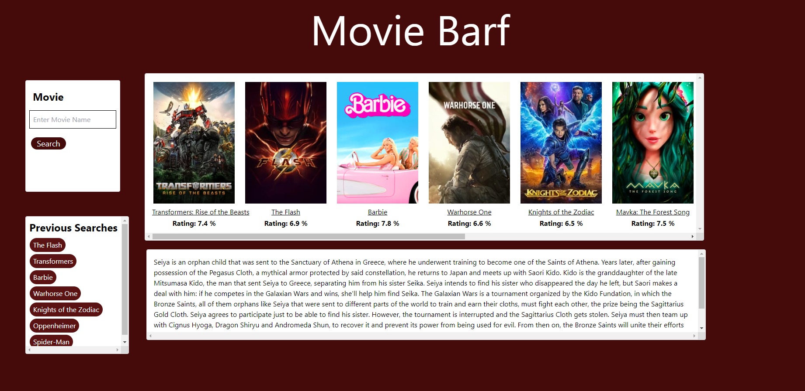

# Movie Barf

## Project description:
Our group project aims to develop an innovative application that revolutionizes the way movie enthusiasts explore and access local movie showtimes. With the integration of prominent APIs such as OMDB and TheMovieDB, our application provides users with a comprehensive and user-friendly platform to discover and enjoy movies. The key feature of our application is the ability to display "Now Playing" movies, and after searching by movie name, generating the plot synopsis. By leveraging the OMDB API, we ensure that users have a visual display of "Now Playing" movies, complete with title and user ratings. This feature empowers moviegoers to easily find movies they are interested in and plan their entertainment accordingly.
The OMDB API is used to power the "Now Playing" on-load banner of movies.
The TheMovieDB API is used to pull the plot descriptions.
Client-side local storage is used to capture the search history.
Tailwind CSS was used for our framework (along with some specific CSS in a separate file).

https://samanthagard13.github.io/Movie-Barf/

## User story:
As a movie enthusiast, I want to easily find currently playing movies, along with their ratings, so that I can plan my movie-watching experience effectively.
As a user, I want to be able to open the application and search a movie title and find a description of the plot.
As a decider, I want to see a listing of my search history so I know which movies I have perused already.

## Resources
Credit to Rahul, Ryan, and Carl for their assistance in troubleshooting both our code and GIT issues.
Credit to ChatGPT on assistance with troubleshooting syntax.
Credit to the API's that allow us to fetch data and power our site.

